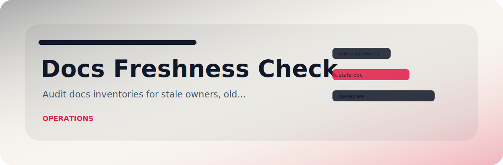
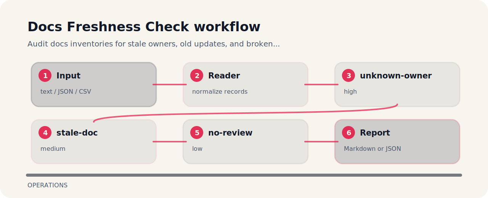

# Docs Freshness Check



Audit docs inventories for stale owners, old updates, and broken review cadence.

## Input contrast

```text
risky: doc api-auth owner unknown updated 2023 review none
clean: doc api-auth owner dx updated 2026 review quarterly
```

## Rule ledger

| Signal | Level | What it flags | Fix direction |
| --- | --- | --- | --- |
| `unknown-owner` | high | doc owner missing | assign documentation owner |
| `stale-doc` | medium | doc appears stale | review and update doc |
| `no-review` | low | review cadence missing | add review cadence |

## Finding map



## Command path

```bash
git clone https://github.com/mertefekurt/docs-freshness-check.git
cd docs-freshness-check
python -m pip install -e ".[dev]"
docs-freshness-check examples/sample.txt
```
